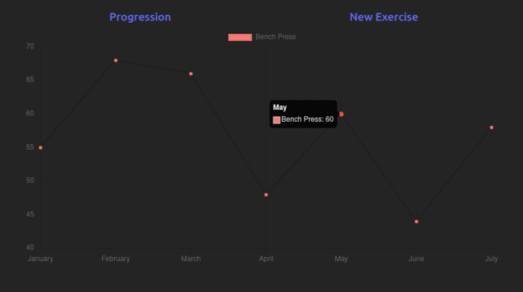

# Fitness Progression Webapp

Part of a HACK-OH/IO project, this Vue API webapp serves as the UI for use with the backend app. The project hoped to solve the issue of modern fitness apps that require paid services to analyze your fitness trends by providing a basic visualization via a Vue frontend utilizing Chart.js.

See [Fitness Progression Resource](https://github.com/jansen-craft/fitness-progression-resource)

This app utilizes the frontend Javascript framework Vue. None of us had ever used Vue in the past and this project served us as an introduction. We also used a package called Chart.js to generate the charts seen in the image below. This hackathon was irregular in that a few of the teammates were not able to contribute throughout the contest, but we leared a lot because of the forced independence. Vue was a very nice change from Angular, which two of us were familiar with and we hope to use it in future projects!

## Homepage



## Technologies

<div>
    <p>
      <a align="left" href="https://github.com/vuejs"></a>
      <a align="right" href="https://www.chartjs.org"></a>
    </p>
</div>

## Setup
To install dependencies:

```bash
npm install
```

To run:

```bash
npm run dev
```